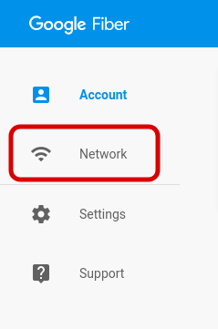
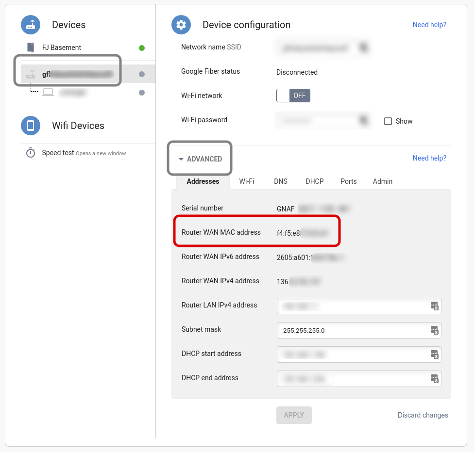
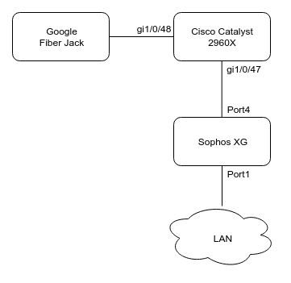
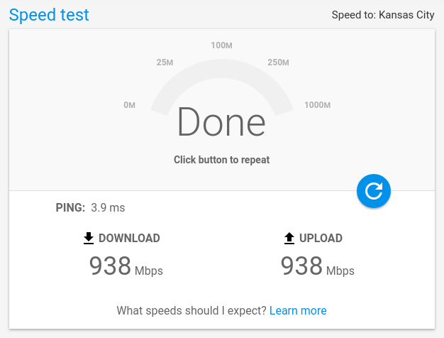

# Google Fiber Network Box Bypass

## Disclaimer

> __This will cover the internet service only, and will likely break your TV Service, I've read that this may work for TV Service as well, but have no way of testing!__
>
> __Google Fiber will not provide support if you bypass their network box.__
> I've had a couple "chill" support folks who have helped me on occasion, but they usually stick to the "we don't see the Google Fiber box connected" if you try to play dumb.
>
> Basically...
>
> - _Do this setup at your own risk!_
> - I don't claim to be __Super-CCIE-Man__ (hell, or even CCNA-Man) or the expert on and other of these topics. So, some of this might not be the best explanation, and some of it might just be straight up wrong. Drop me a line if there is something that needs corrected.

## Summary

This setup will enable the full 1Gbps Download __and Upload__ without the need for the Fiber Network Box on Google Fiber's Residential Service.

> If you have Google Fiber _Business Service_, you do __NOT__ need to follow these instructions. Simply hook your Firewall or Router directly to the Fiber Jack and enable DHCP!

If you've ever tried to bypass your network box you'll notice that it doesn't work. The reason here is two-fold.

1. The Google Fiber Box tags (trunks) VLAN 2 to carry outbound WAN traffic to the Fiber Jack.
2. The Google Fiber Box marks outbound packets with a [CoS (Class of Service)](https://searchnetworking.techtarget.com/definition/Class-of-Service-CoS) tag.
    - While there are a number of CoS tags that are used depending on the traffic type, I've found that just setting CoS 2 to everything works fine so we'll use that here.

>Those are the two items that we will work to configure, using the Catalyst Switch, in order to bypass the Google Fiber Network Box.

Here I will document and attempt to provide basic instructions, with bare bones explanation as I see fit on how to bypass your Google Fiber Network Box to place your own Firewall directly on the Google Fiber Fiber Jack without routing through the Fiber Box. My adventure will cover Cisco Catalyst switches, as that's what I have in my lab.

_The source of most of this configuration comes out from a colleagues. Much thanks to him for all his help!_

## Before we Start!

We're going to want to record the WAN Port Mac Address of your Google Fiber box! I've found that this is good information to have for later troubleshoot if you run into issue.

1. With your Google Fiber Network Box plugged in and working...
2. Login to your Google Fiber account by going to [HTTPS://fiber.google.com](https://fiber.google.com)
3. Navigate to __Network__ on the left hand menu

    

4. Under _Devices_ on the left hand menu, you should see your Fiber Jack, then below it should be your Network Box name.
5. Under _Device Configuration_ expand __Advanced__ and locate and make note of the _Route WAN MAC Address_ for future reference.

    

## Table of Contents

1. Assumptions
2. My Configuration
3. Cisco Catalyst Switch Setup
4. Firewall Setup

## 1. Assumptions

This isn't going to be really 101 level, so please have the following:

1. A basic understanding of networking.
    - We're not going to go into the basics of Networking, VLAN's, or COS here, but there are loads of resources available. If you're interested, reach out and I'll see where I can point you!
2. A configured, accessible, and (somewhat) updated Cisco Catalyst Switch.
    - __VLAN 2 not in use__
    - 2 available ports
3. A configured and accessible firewall.
    - We're going to be referencing back to a Sophos XG here, but I'll make the instructions as universal as possible.
    - This will work with a basic ASUS/D-LINK/Etc... home router, but it might be difficult to perform portions of the setup on these.

## 2. My Configuration

### Network Diagram

This is the basic overview of my environment for reference.



> [draw.io](https://www.draw.io) is a great tool :)

### Hardware Detail

_All of the following is the configuration of my lab at time of publishing._

The only thing that really matters here is the __Switch__, everything else can be swapped out as needed.

- Switch
    - Cisco Catalyst 2960X
        - Firmware 15.2(2a)E1
- Firewall
    - Old Dell Optiplex 960 running Sophos XG
        - Sophos XG (SFOS 17.5.1 MR-1)
        - CPU: Core 2 Duo
        - RAM: 6GB
        - NIC: 4 Port HP Branded Intel PCIe

## 3. Cisco Catalyst Switch Setup

I assume at this point you've identified the ports that you are going to use. If not, go ahead and choose two ports, any two... Really... For my documentation, I will call my two ports "GF" and "FW_WAN"

| Name      | Interface |
| --------: | :-------- |
| GF        | Gi1/0/48  |
| FW_WAN    | Gi1/0/47  |

### 3.1. Basic Catalyst Configuration

Here we are going to configure a few rules for the Catalyst switch to setup some policies that we will use on the ports later to work around the thing I mentioned earlier about CoS and Upload Speed Limitation.

We're going to want to add the following configuration to the Catalyst, __these changes should NOT cause disruption or reload!__

> You can literally copy and paste this into your switch once you are in config mode, just think about what you're running!

```config
# Setup VLAN 2
vlan 2
 name "Google_Fiber"

# Enable QOS on the switch
mls qos

# Create our Class Map
class-map match-any mark-traffic-class
 match access-group name mark-traffic-acl

# Create our Policy Map to set CoS Tag
policy-map mark-traffic-policy
 class mark-traffic-class
  set precedence 2

# Create our Access List to match interesting traffic
ip access-list extended mark-traffic-acl
 permit ip any any
```

### 3.2. FW_WAN Configuration

So, this it going to be where part of the magic happens. We'll be referencing back into what we configured earlier to ensure that the traffic is tagged correctly.

```config
# Setup Firewall Interface and mark INPUT traffic with our Service Policy
interface GigabitEthernet1/0/47
 description FW_WAN
 switchport access vlan 2
 switchport mode access
 mls qos cos 2
 mls qos cos override
 service-policy input mark-traffic-policy
```

### 3.3. GF Configuration

Now, we're going to setup the Google Fiber Port. There's really nothing crazy that happens here other than tagging (trunking) the VLAN.

```config
# Setup your Fiber Jack port
interface GigabitEthernet1/0/48
 description GF
 switchport trunk allowed vlan 2
 switchport mode trunk
 mls qos cos 2
 mls qos cos override
 no cdp enable
 service-policy input mark-traffic-policy
```

Now, that should be it for the Catalyst. Let's just talk for a moment about the...

### Wait, you did `copy run start` right?

Anyway, onto the...

## 4. Firewall Configuration

There's not much to talk about here, and in fact, you can just hook your firewall's WAN interface up to the FW_WAN port and enable DHCP. There are a few things to note here.

1. I've read that you should enable DHCP for both IPv4 and IPv6, I've done this with and without IPv6 and haven't experienced any issue eitherway
2. From my experience my IP stays doesn't change, I haven't noticed it change at my current residence for the past 10 months.

### DHCP Note

I've had trouble where my firewall never receives DHCP. There are a few things that I've done to fix this, and I would try the following, __in order__.

1. Unplug the Google Fiber Jack from Power and Network
    - Let it sit for a moment then plug it back in and come up.
2. Set the Mac Address of the Firewall's WAN interface to the same MAC Address as the Google Fiber Box's WAN Port

> This can be a bit more complicated depending on your firewall manufacturer. The easiest way to find this mac address is to review the _Before we Start_ section at the beginning of this document!

## Closing

Now, go ahead and go over to [speedtest.googlefiber.net](https://speedtest.googlefiber.net) and make sure you're getting what you paid for.



### My numbers still suck!

1. Ensure that you are connected via a Gigabit Wired connection!
    - Really, even though your _manufaturer-name_ Wireless router/access point says "SPEEDS UP TO 1500Mbps!!!" it likely won't actually go that fast in realworld conditions (yet).
2. Unplug your setup and plug the fiber box back in and plug directly to that.
    - If you get good speed now...
        1. review the instructions and ensure that you have setup CoS correctly in the Cisco Catalyst Section.
        2. Plug your Firewall's WAN port into the LAN of the Google Fiber Network Box, not plug in behind the firewall and run again.
            - If your speed is bad, your firewall is likely not fast enough!
                - Turn off advanced features, like Web Filtering and Application Control if you have them on.
                - You can find an old PC with a Core 2 Duo and 4+ GB of Ram for Cheap on ebay. Throw a 4-port Intel Based NIC into it and your gouda. I've had great luck with my old Dell Optiplex 960 (like $40 on ebay!) setup with [Sophos XG Home Edition](https://www.sophos.com/en-us/products/free-tools/sophos-xg-firewall-home-edition.aspx)! It's free and easy to setup!
                    - You could also run PFSense or another free firewall, but ensure that it's not to bulky!
                - Look into something like the [Ubiquiti Edgemax](https://www.ui.com/products/#edgemax) that says it's capable of >=1Gbps/1000Mbps speed.

That should be it for the setup. Once again, if you have any issues you can reach out to me directly and I'm happy to give whatever assistance I can with your setup. I am interested in expanding this to include additional items. So please feel free to pull and add what you think should be in here!